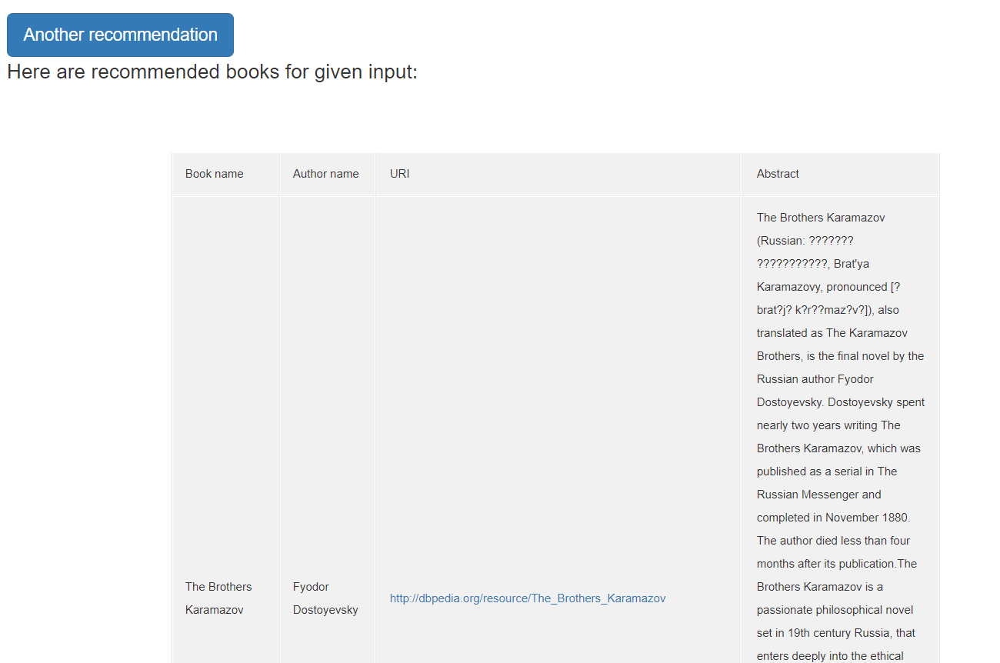
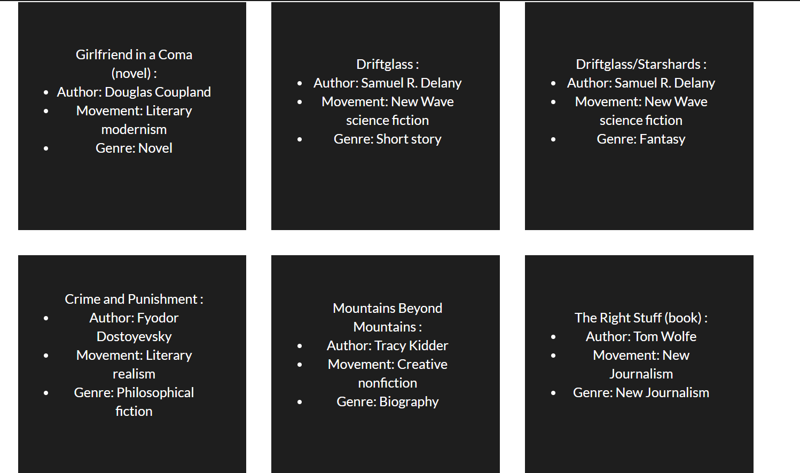

# Book Recommender - Clojure

## Running the application

Application can be started from the terminal, simply by runnung ***lein run***. Then, the endpoint in the browser is ***localhost:3000***. 

##About the project

The aim of this project was to investigate Clojure as a language with as many aspects of it as possible (writing algorithms, database, template engines, validation, testing, ...) as a part of technology stack in software engineering. The idea was to write Machine Learning application for recommending books based on book's attributes of selected book, using cosine similarity algorithm.

Though the Web was originally conceived to be used by human users, new data-oriented content have been produced and made available on the Web with the introduction and development of the [Semantic Web idea](https://en.wikipedia.org/wiki/Semantic_Web). In particular,
more recently there has been a growing interest in the [Linked Open Data (LOD) initiative](http://linkeddata.org). The cornerstone of Linked Open Data is making available free and open RDF datasets linked with each other. 

The project was inspired by the paper by Mirizzi et al [1], where authors describe a web application for movie recommendation based on movie's attributes.

The project workflow consists of the following steps:
*	Collecting data from [DBPedia](http://wiki.dbpedia.org/) and preprocessing
*	Building recommendation system
*   Building of Clojure Web application
*	Implementation
*	Technical realisation

##Collecting data from DBPedia and preprocessing

Datasets used in this project are extracted from the DBpedia, the RDF-based version of Wikipedia. [RDF](https://www.w3.org/RDF/)(Resource Description Framework) is a standard model for data interchange on the Web. For searching DBPedia we have used [SPARQL](https://www.w3.org/TR/rdf-sparql-query/) (The Simple Protocol and RDF Query Language), which makes possible to ask complex queries to DBpedia.

The example of a SPARQL query for extracting the data is displayed in the Listing 1. Books are filtered by movements of their authors. Only books that have all of their attributes values in English are considered and used for the recommender system. In the *SELECT* part of the query, attributes required for the dataset are listed. 
```
PREFIX rdf: <http://www.w3.org/1999/02/22-rdf-syntax-ns#>
PREFIX rdfs: <http://www.w3.org/2000/01/rdf-schema#>
PREFIX dbpedia: <http://dbpedia.org/resource/>
PREFIX ontology: <http://dbpedia.org/ontology/>

SELECT DISTINCT ?bookURI ?bookName ?authorName ?authorMovement ?bookGenre ?bookAbstract
where {
?bookURI rdf:type ontology:Book .
?bookURI  ontology:author ?author .
?bookURI  ontology:abstract ?bookAbstract . 
?bookURI  ontology:literaryGenre ?genre . 
?bookURI rdfs:label ?bookName .

?author rdfs:label ?authorName . 
?author ontology:movement ?movement .
?genre rdfs:label ?bookGenre . 
?movement rdfs:label ?authorMovement .
FILTER (regex(?authorMovement, "Romanticism", "i") || regex(?authorMovement, "Realism", "i") || regex(?authorMovement, "Social novel", "i") || regex(?authorMovement, "19th-century French literature", "i") || regex(?authorMovement, "Proletarian literature", "i") || regex(?authorMovement, "Science fiction", "i") || regex(?authorMovement, "Detective fiction", "i") || regex(?authorMovement ,"Impressionism", "i") || regex(?authorMovement ,"Modernism", "i"))
FILTER (lang(?authorName) = "en" && lang(?bookName) = "en" && lang(?bookAbstract) = "en" && lang(?authorMovement) = "en" && lang(?bookGenre) = "en") 

}
```
*Listing 1 - SPARQL query for collecting data*

The results of this query are available [here](http://dbpedia.org/sparql?default-graph-uri=http%3A%2F%2Fdbpedia.org&query=PREFIX+rdf%3A+%3Chttp%3A%2F%2Fwww.w3.org%2F1999%2F02%2F22-rdf-syntax-ns%23%3E%0D%0APREFIX+rdfs%3A+%3Chttp%3A%2F%2Fwww.w3.org%2F2000%2F01%2Frdf-schema%23%3E%0D%0APREFIX+dbpedia%3A+%3Chttp%3A%2F%2Fdbpedia.org%2Fresource%2F%3E%0D%0APREFIX+ontology%3A+%3Chttp%3A%2F%2Fdbpedia.org%2Fontology%2F%3E%0D%0A%0D%0Aselect+distinct+%3FbookURI+%3FbookName+%3FauthorName+%3FauthorMovement+%3FbookGenre+%3FbookAbstract%0D%0Awhere+%7B%0D%0A%3FbookURI+rdf%3Atype+ontology%3ABook+.%0D%0A%3FbookURI++ontology%3Aauthor+%3Fauthor+.%0D%0A%3FbookURI++ontology%3Aabstract+%3FbookAbstract+.+%0D%0A%3FbookURI++ontology%3AliteraryGenre+%3Fgenre+.+%0D%0A%3FbookURI+rdfs%3Alabel+%3FbookName+.%0D%0A%0D%0A%3Fauthor+rdfs%3Alabel+%3FauthorName+.+%0D%0A%3Fauthor+ontology%3Amovement+%3Fmovement+.%0D%0A%3Fgenre+rdfs%3Alabel+%3FbookGenre+.+%0D%0A%3Fmovement+rdfs%3Alabel+%3FauthorMovement+.%0D%0AFILTER+%28regex%28%3FauthorMovement%2C+%22Romanticism%22%2C+%22i%22%29+%7C%7C+regex%28%3FauthorMovement%2C+%22Realism%22%2C+%22i%22%29+%7C%7C+regex%28%3FauthorMovement%2C+%22Social+novel%22%2C+%22i%22%29+%7C%7C+regex%28%3FauthorMovement%2C+%2219th-century+French+literature%22%2C+%22i%22%29+%7C%7C+regex%28%3FauthorMovement%2C+%22Proletarian+literature%22%2C+%22i%22%29+%7C%7C+regex%28%3FauthorMovement%2C+%22Science+fiction%22%2C+%22i%22%29+%7C%7C+regex%28%3FauthorMovement%2C+%22Detective+fiction%22%2C+%22i%22%29+%7C%7C+regex%28%3FauthorMovement+%2C%22Impressionism%22%2C+%22i%22%29+%7C%7C+regex%28%3FauthorMovement+%2C%22Modernism%22%2C+%22i%22%29%29%0D%0AFILTER+%28lang%28%3FauthorName%29+%3D+%22en%22+%26%26+lang%28%3FbookName%29+%3D+%22en%22+%26%26+lang%28%3FbookAbstract%29+%3D+%22en%22+%26%26+lang%28%3FauthorMovement%29+%3D+%22en%22+%26%26+lang%28%3FbookGenre%29+%3D+%22en%22%29+%0D%0A%0D%0A%0D%0A%7D&format=text%2Fhtml&CXML_redir_for_subjs=121&CXML_redir_for_hrefs=&timeout=30000&debug=on).
Extracted data is stored into a CSV file [data/bookDataSet.csv](https://raw.githubusercontent.com/markosavic993/BookRecommendation/master/data/bookDataSet.csv). Snippet of the collected data is given in the Listing 2.
```
uri,name,author_name,author_movement,genre,abstract

http://dbpedia.org/resource/The_Brothers_Karamazov,The Brothers Karamazov,Fyodor Dostoyevsky,Literary realism,Philosophical fiction,The Brothers Karamazov also translated as The Karamazov Brothers, is the final novel by the Russian author Fy...	

http://dbpedia.org/resource/Crime_and_Punishment,Crime and Punishment,Fyodor Dostoyevsky,Literary realism,Philosophical fiction/Psychological novel,Crime and Punishment is a novel by the Russian author Fyodor Dostoyevsky. It was first published in the lit...

http://dbpedia.org/resource/The_Village_of_Stepanchikovo,The Village of Stepanchikovo,Fyodor Dostoyevsky,Literary realism,Satire,The Village of Stepanchikovo also known as The Friend of the Famil...					
```
*Listing 2 - Data snippet*

##Building recommendation system

###Vector Space Model

In order to compute the similarities, [VSM (Vector Space Model)](https://en.wikipedia.org/wiki/Vector_space_model) is implemented. In VSM non-binary weights are assigned to index terms in queries and in documents (represented as sets of terms), and are used to compute the degree of similarity between each document in the collection and the query. [1]

Book attributes that are used as a base for recommendation are:
* author_name - name of a book's author,
* genre - a genre of a book,
* author_movement - the literary movement of a book's author.

So, the goal is to create a vector of values for the listed attributes for every book and calculate its similarity score with vectors of all other books in the dataset.

To increase precision, it's recommended to use TFIDF values for creating vectors. TF(term-frequency) is a measure of how many times the terms present in vocabulary E(*t*) are present in the documents, we define the term-frequency as a couting function [4]:


where the fr(*x, t*) is a simple function defined as:


In *Listing 3*, the code snippet for calculating *tf value* for given attribute values, is shown. Note that book attributes (author name, genre and author movement) are either same or not, so the *tf* value would be either 1 or 0.
```clojure
(defn calculate-tf
      "returns double value that represents term frequency"
      [refAttributeValue currentAttributeValue]
      (double (if (= refAttributeValue currentAttributeValue)
            1
            0)))
```
*Listing 3 - Clojure code for calculating tf*

Some terms may be very common, so we use IDF (Inverse Document Frequency) which diminishes the weight of terms that occur very frequently in the document set and increases the weight of terms that occur rarely. In context of book recommendation, it's obvious that *author_name* attribute is more relevant for recommending system then *author_movement* attribute, because there are many more books that belongs to *Literary realism* movement then books writen by *Fyodor Dostoyevsky*. IDF is calculated according to next formula:


with

*  **N**: total number of documents in the corpus **N** = **|D|**
* **|{d in D : t in d}|** : number of documents where the term **t** appears. 

In *Listing 4*, a snippet of Clojure code for calculating *idf* values for provided attribute, is displayed.
```clojure
(defn calculate-idf
      "returns double value that represents inverse document frequency"
      [mainSet dataSet]
      (if (= 0 (count (filter #(= mainSet %) dataSet))) (throw (InvalidParameterException. "provided data entry is not from provided dataset")))
      (Math/log10 (/ (count dataSet)
                     (count (filter #(= mainSet %) dataSet)))))
```
*Listing 4 - Clojure code for calculating idf*

### Cosine similarity

[The cosine similarity](https://en.wikipedia.org/wiki/Cosine_similarity) between two vectors (or two documents in the Vector Space) is a measure that calculates the cosine of the angle between them. This metric is a measurement of orientation and not magnitude, it can be seen as a comparison between documents on a normalized space. The equation for calculating cosine similarity is depicted in *Figure 1* [2]:

 *Figure 1 - Cosine similarity equation*

The dividend is a dot product of those vectors, and the divisor is a product of vector intensities. Cosine Similarity will generate a metric that says how related are two documents by looking at the angle instead of magnitude. So, the more the result is closer to 1, two vectors (documents/books) are more similar. On the other hand, if the result tends to 0, it means that vectors are opposed (the angle between them is 90 degrees). [3]

In the *Listing 5*, Clojure code for calculating cosine similarity is given.
```clojure
(defn calculate-scalar-product
      "return double value that represents scalar product of vectors"
      [vectorA vectorB]
      (reduce + (map * vectorA vectorB)))

(defn calculate-intensity-of-vector
      "return double value that represents vector's intensity"
      [v]
      (Math/sqrt (reduce + (map * v v))))

(defn calculate-cosine-similarity
      "return a double value of cosine calculators of two vectors"
      [vectorA vectorB]
      {:pre [(= (count vectorA) (count vectorB))]}
      (let [vectorAIntensity (calculate-intensity-of-vector vectorA)
            vectorBIntensity (calculate-intensity-of-vector vectorB)]
        (if (or (= 0.0 vectorAIntensity) (= 0.0 vectorBIntensity))
          0.0
          (/ (calculate-scalar-product vectorA vectorB)
             (* vectorAIntensity vectorBIntensity)))))
```
*Listing 5 - Cosine similarity calculating in Clojure*

##  Building of Clojure Web application

[Leiningen](https://leiningen.org/) is used for build automation and easy dependency handling. In the following listing are presented dependencies listed in **project.clj**
```clojure
:dependencies [[clj-time "0.13.0"]
                 [compojure "1.6.0"]
                 [cprop "0.1.10"]
                 [funcool/struct "1.0.0"]
                 [luminus-immutant "0.2.3"]
                 [luminus-nrepl "0.1.4"]
                 [luminus/ring-ttl-session "0.3.2"]
                 [markdown-clj "0.9.99"]
                 [metosin/muuntaja "0.2.1"]
                 [metosin/ring-http-response "0.9.0"]
                 [mount "0.1.11"]
                 [org.clojure/clojure "1.8.0"]
                 [org.clojure/tools.cli "0.3.5"]
                 [org.clojure/tools.logging "0.3.1"]
                 [org.webjars.bower/tether "1.4.0"]
                 [org.webjars/bootstrap "4.0.0-alpha.5"]
                 [org.webjars/font-awesome "4.7.0"]
                 [org.webjars/jquery "3.1.1"]
                 [org.webjars/webjars-locator-jboss-vfs "0.1.0"]
                 [ring-webjars "0.2.0"]
                 [ring/ring-core "1.6.1"]
                 [ring/ring-defaults "0.3.0"]
                 [selmer "1.10.7"]
                 [clojure-csv/clojure-csv "2.0.1"]
                 [semantic-csv "0.2.1-alpha1"]
                 [org.clojure/java.jdbc "0.7.0-alpha3"]
                 [mysql/mysql-connector-java "5.1.6"]
                 [medley "1.0.0"]]
``` 

The application is generated with [Luminus](http://www.luminusweb.net/), web framework for Clojure, as a plain web app, using command 
```
lein new luminus book-recommender.
```

### Routing

For routing in  this app is used [Compojure](https://github.com/weavejester/compojure), a routing library for [Ring](https://github.com/ring-clojure/ring) (a low-level interface and library for building web applications).
```clojure
(def app-routes
  (routes
    (-> #'home-routes
        (wrap-routes middleware/wrap-formats))
    (route/not-found
      (:body
        (error-page {:status 404
                     :title "page not found"})))))


(defn app [] (middleware/wrap-base #'app-routes))

...

(defroutes home-routes
  (GET "/" [] (res/redirect "/login"))
  (GET "/about/:username" [username] (about-page username))
  (GET "/login" [] (login-page))
  (GET "/register" [] (register-page))
  (GET "/dashboard" [user] (dashboard-page user))
  (POST "/login" [username password]
    (handle-login username password))
  (POST "/register" [firstname lastname username password repeatpwd]
    (handle-register firstname lastname username password repeatpwd))
  (POST "/search" [logged-in-user search-input] (handle-search-request logged-in-user search-input))
  (POST "/recommend" [num-of-recommendations book user]
    (handle-recommendation-request book user num-of-recommendations))
  (GET "/profile/:username" [username] (profile-page username))
  (GET "/dashboard/:username" [username] (dashboard-page (db/search-for-user username)))
  (POST "/change-password" [username newpwd repeatedpwd] (profile-page username newpwd repeatedpwd))
  (GET "/contact/:username" [username] (contact-page username))
  (GET "/books/:username" [username] (books-page username)))
```


### Template engine

As a template engine, for the purposes of this project, is used [Selmer](https://github.com/yogthos/Selmer), very user friendly and *Django* inspired templating system. Here is the example of using this library in the main page of the app:
```html
<h1>Welcome, {{logged-in-user.username}}!</h1>
...
<tbody>
                    
                    <tr>
                        <td>{{book.name}}</td>
                        <td>{{book.author_name}}</td>
                        <td><a href="{{book.uri}}">{{book.uri}}</a></td>
                        <td>
                            <form action="/recommend" method="post">
                                <input type="text" name="num-of-recommendations" value="5" placeholder="Number of recommendations...">
                                <input type="hidden" name="book" value="{{book}}">
                                <input type="hidden" name="user" value="{{logged-in-user}}">
                                <p align="center" data-placement="top" data-toggle="tooltip" title="Recommend">
                                    <input type="submit" class="btn btn-primary btn-xs" data-title="Recommend">
                                </p>
                            </form>
                        </td>
                    </tr>
                    
                    </tbody>
```

Also, with *Selmer*, reusing of templates is very easy which is presented in the following code snippet:
```html
<div class="container">
    
    
</div>
...


<div class="row">
  <div class="col-sm-12">
    {{docs|markdown}}
  </div>
</div>

```

### Database

For managing database implementation is used [**java.jdbc**](https://github.com/clojure/java.jdbc). It's a *Clojure* wrapper for [jdbc](https://en.wikipedia.org/wiki/Java_Database_Connectivity), which improves usability of it and makes it more readable. These are some of the examples of using this library in ***book-recommender***:
```clojure
(def db-spec
  {:dbtype "mysql"
   :dbname "book_recommendation"
   :user "root"
   :password "password"})
...
(defn insert-user
  "insert user to the database"
  [username password firstname lastname]
  (jdbc/insert! db-spec "user"
                {:username username :password password :firstname firstname :lastname lastname}))
...
(defn get-books-searched-by-user
  "gets books searched by user with given username"
  [username]
  (into []
        (map #(search-for-book (:book %))
             (jdbc/query db-spec
                         ["SELECT * FROM searched_books WHERE user = ?" username]))))
```

Database is present in path: *resources/sql*.

### Testing

All the code where algorithm is implemented is tested, Libraries used for unit tests of the algorithm and routing are [clojure.test](https://clojure.github.io/clojure/clojure.test-api.html) and [ring.mock](https://github.com/ring-clojure/ring-mock). Testing in *Clojure* is very descriptive and makes it easy to read and write. Here are the examples of tests:
```clojure
(deftest test-tf
  (testing "calculation of tf of given inputs")
  (let [firstParam "Dostoyevsky"
        matchingParam "Dostoyevsky"
        notMatchingParam "Tolkin"]
    (is (= 1.0 (calculate-tf firstParam matchingParam)))
    (is (= 0.0 (calculate-tf firstParam notMatchingParam)))))

(deftest test-idf
  (testing "calculation of idf of given inputs")
  (let [param "A"
        dataSet ["A" "A" "C" "B"]
        notMatchingDataSet ["C" "D"]]
    (is (= 0.3010299956639812 (calculate-idf param dataSet)))
    (is (thrown? InvalidParameterException (calculate-idf param notMatchingDataSet)))))
    
(deftest finder-test
  (testing "finding books that match user's search input")
  (let [data (load-data-from-file "testBookDataSet.csv")
        search-input "bOOk"
        expectedresult [{:name "first book",
                         :author_name "Dostojevski",
                         :author_movement "Drama",
                         :genre "srednji vek"},
                        {:name "second book",
                         :author_name "Dostojevski",
                         :author_movement "komedija",
                         :genre "novi vek"},
                        {:name "el book",
                         :author_name "Bajron",
                         :author_movement "drama",
                         :genre "romantizam"}]]
    (is (= expectedresult (find-by-name search-input data)))))
```

Tests (or specific test) could be run using leiningen tasks:
```
lein test
lein test :only book-recommender.test.engine.book-recommedner-engine-test/test-recommender
```

### Validation

Validating user input was also a great opportunity to practice writing *Clojure* code and write tests (see the following listing).
```clojure
(defn validate-login-form
  "validates login form (username and password)"
  [username password]
  (if (< (count username) 3)
    "Username must have at least 3 characters!"
    (if (or (nil? (re-find #"\d+" password))(< (count password) 6))
      "Password must contain at least 6 characters, with at least one numeric character!"
      "")))

(defn validate-register-form
  "validates register form (username, password, first name, last name and repeated password)"
  [username password firstname lastname repeatedpwd]
  (if (< (count username) 3)
    "Username must have at least 3 characters!"
    (if (or (nil? (re-find #"\d+" password))(< (count password) 6))
      "Password must contain at least 6 characters, with at least one numeric character!"
      (if (not= password repeatedpwd)
        "Passwords don't match!"
        ""))))
...

(deftest test-validate-login-form
  (testing "correct validation of login form")
  (let [short-username "a"
        short-password "a"
        password-without-number "abcdef"
        ok-username "marko"
        ok-password "marko123"
        bad-username-message "Username must have at least 3 characters!"
        bad-password-message "Password must contain at least 6 characters, with at least one numeric character!"]
    (is (= bad-username-message (validate-login-form short-username short-password)))
    (is (= bad-password-message (validate-login-form ok-username short-password)))
    (is (= bad-password-message (validate-login-form ok-username password-without-number)))
    (is (= "" (validate-login-form ok-username ok-password)))))
```

## Workflow of the application

After successful login/register, user will be redirected to *dashboard page* which is the main point of the application. 


```clojure
(defn dashboard-page
  ([user]
  (layout/render "dashboard.html" {:logged-in-user user}))
  ([user books]
   (layout/render "dashboard.html" {:logged-in-user user :found-books books})))
```


As you can see, page is rendered with different input parameters, which is in *Clojure* known as [multi-arity function](http://clojure-doc.org/articles/language/functions.html#multi-arity-functions)

After that, user enters search query, which returns books that matches user's input.

```clojure
(def path-to-data "resources/books.csv")

(def books (reader/load-data-from-file path-to-data))

(defn find-by-name
  "finds books by provided name"
  ([search-input]
  (distinct-by #(:uri %)
               (filter #(.contains
                          (.toUpperCase (get % :name))
                          (.toUpperCase search-input))
                       books)))
  ([search-input data]
   (distinct-by #(:uri %)
                (filter #(.contains
                           (.toUpperCase (get % :name))
                           (.toUpperCase search-input))
                        data))))
```

The second version of the function (with two arguments) is used for testing.

Finally, user choose book and enters the number of recommendations wanted. After the ***submit*** button is clicked, *recommendation engine* will provide desired number of recommendations.

```clojure
(def path-to-production-data "resources/books.csv")

(def book-data-set (reader/load-data-from-file path-to-production-data))

(defn recommend-books
  "recommends books for given ref book"
  [ref-book num-of-recommendations data]
  (let [ref-book-vector (creator/create-book-vector ref-book
                                                  ref-book
                                                  data)
        vectors (map #(creator/create-book-vector ref-book % data) data)
        valuedBooksVector (into [] (map #(calculator/calculate-cosine-similarity ref-book-vector %) vectors))
        book-similarity-map (sort-by :value > (remove #(= (:book %) ref-book) (map (fn [key value] {:book key :value value}) data valuedBooksVector)))]
        (into [] (take num-of-recommendations
                       (distinct-by #(:uri (:book %)) book-similarity-map)))))

(defn recommend-for-book
  "recommends books for given input for production data"
  [ref-book num-of-recommendations]
  (map #(:book %) (recommend-books (read-string ref-book)
                   num-of-recommendations
                   book-data-set)))
```

On the *books page*, user can see all the books that he have searched for:  

```clojure
(defn books-page [username]
  (layout/render "books.html" {:logged-in-user (db/search-for-user username)
                               :searched-books (db/get-books-searched-by-user username)}))
...



<div class="wrapper">
    <div class="square">
        <div class="content">
            <div class="table">
                <div class="table-cell">
                    <ul class="un_list">{{book.name}} :
                        <li class="list_item">Author: {{book.author_name}}</li>
                        <li class="list_item">Movement: {{book.author_movement}}</li>
                        <li class="list_item">Genre: {{book.genre}}</li>
                    </ul>
                </div>
            </div>
        </div>
    </div>
</div>


```


